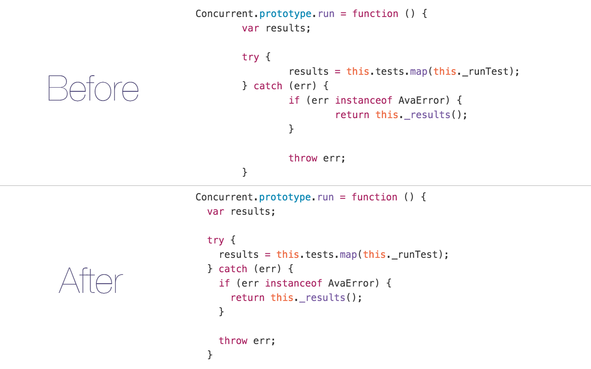

__This is just a fork of [sindresorhus's tab size plugin](https://github.com/sindresorhus/tab-size-on-github) for a tab size of 2 instead of 4.__

# Tab Size on GitHub

> Chrome/Opera extension - Make tab indented code more readable by forcing the tab size to 2 instead of 8

It's intentionally simple and I'm not interested in adding anything more to it.

## Install

* [Chrome extension](https://chrome.google.com/webstore/detail/tab-size-on-github-size-2/mghflbfcpghfbcldbjfglegbklpljeie)
* Opera add-on (coming soon)
* Safari add-on (coming soon)

## License

MIT © [Adrien Antoine](http://adriantoine.com)
